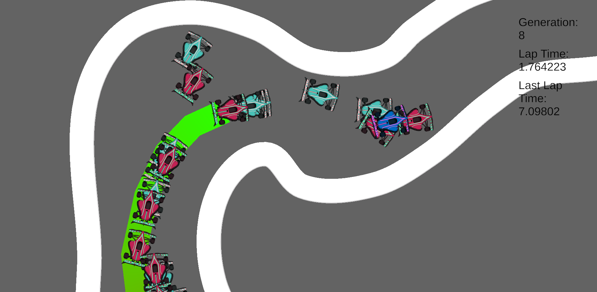
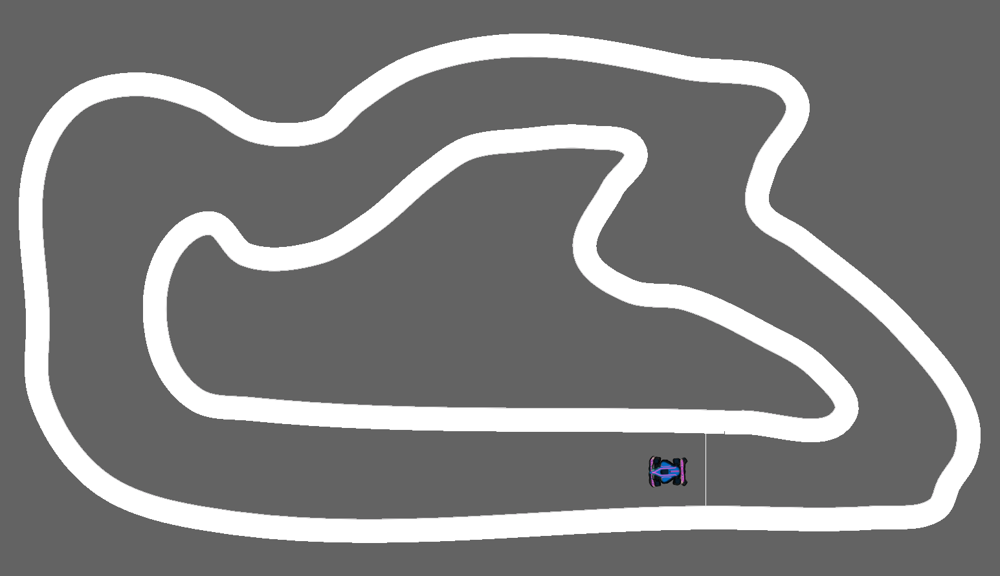
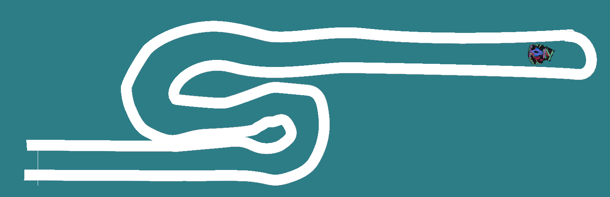
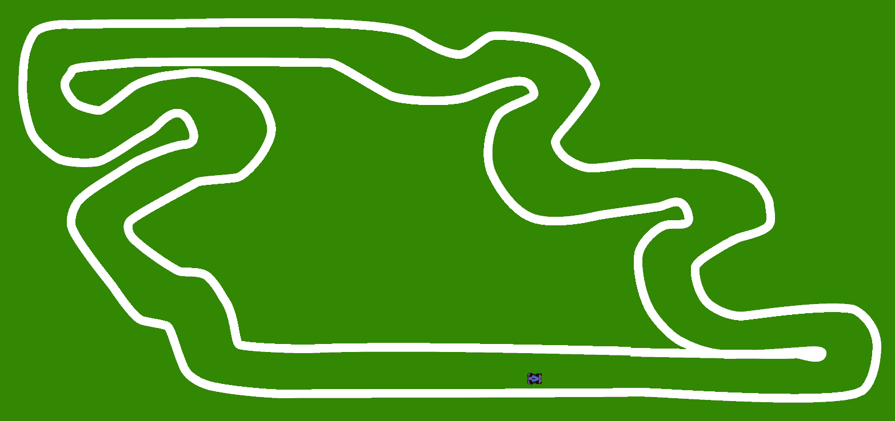

# Genetic Algorithm Car Driving Project

## Overview

This Unity project demonstrates the use of **genetic algorithms** to train **neural networks** for driving cars around tracks. The project includes **three tracks**, and the cars gradually improve their performance over generations. This is achieved by applying **elitist genetic algorithms**, ensuring the best solutions from one generation are preserved for the next.

  

### How it Works

1. **Generational Learning**:  
   The cars are trained using a **genetic algorithm** approach. Each generation consists of 100 cars, based on research showing this number to be effective for achieving significant performance improvements.
   - The **elitist approach** ensures that the best-performing cars are passed on to the next generation, preventing the loss of progress.
   - The cars gradually improve their performance, becoming faster and more efficient at completing the track.

2. **Neural Network Inputs & Outputs**:  
   Each car is powered by a **neural network** that takes in **five raycast inputs**:  
   - Left
   - Front-left
   - Front
   - Front-right
   - Right

   These inputs are fed into the network, which produces two output values (ranging from -1 to 1):  
   - **Steering**: Controls the car's turning angle (left or right).
   - **Throttle**: Controls acceleration or braking.


3. **Track and Performance Visualization**:  
   - The cars drive around one of the three tracks, with each generation improving its speed and accuracy.
   - The **best car's path** is highlighted in each generation to showcase its learned **racing line**.

  


### Project Features

- **Unity Engine**: Built with Unity, leveraging the physics and rendering capabilities.
- **C# Implementation**: The core logic, including the genetic algorithm and neural network, is coded in C#.
- **Visualization**: See the real-time learning process as cars evolve their racing strategies over time.
- **Track Variety**: The project includes three different tracks, each with unique challenges.

  
  
  

### Getting Started

#### Prerequisites

- Unity 2021 or later
- Basic knowledge of C# and Unity scripting

#### Installation

1. Clone the repository (or download the zip file of the project):
    ```bash
    git clone https://github.com/Umar-Kamran/Genetic-Car-Trainer.git
    ```
2. Open the Build folder

3. Open the GeneticCar.exe

#### Controls

##### Keyboard:
- 0-9: Alter the simulation speed scale from 0x speed to 9x speed
- Q: Change camera mode to follow fittest car
- E: Change camera mode to follow user inputs
- WASD (User camera mode): Move camera
- Scroll wheel up: Zoom in camera view
- Scroll wheel down: Zoom out camera view
- Backspace: Very high simulation speed (Very resource intensive and may crash application so not use is not recommended unless using a small neural network with a population size < ~ 50)


#### Customization

You can customize the following parameters in the **Genetic Algorithm**:
- **Population size**: Adjust the number of cars per generation.
- **Neural network structure**: Edit the number of, and size of, hidden layers.

### Future Improvements

- [ ] Increase the complexity of neural networks.
- [ ] Implement new genetic algorithms.
- [ ] Introduce new track designs with varied obstacles.
- [ ] Implement more realistic physics to control the cars.

---

### License

This project is licensed under the MIT License - see the [LICENSE.txt](LICENSE.txt) file for details.

